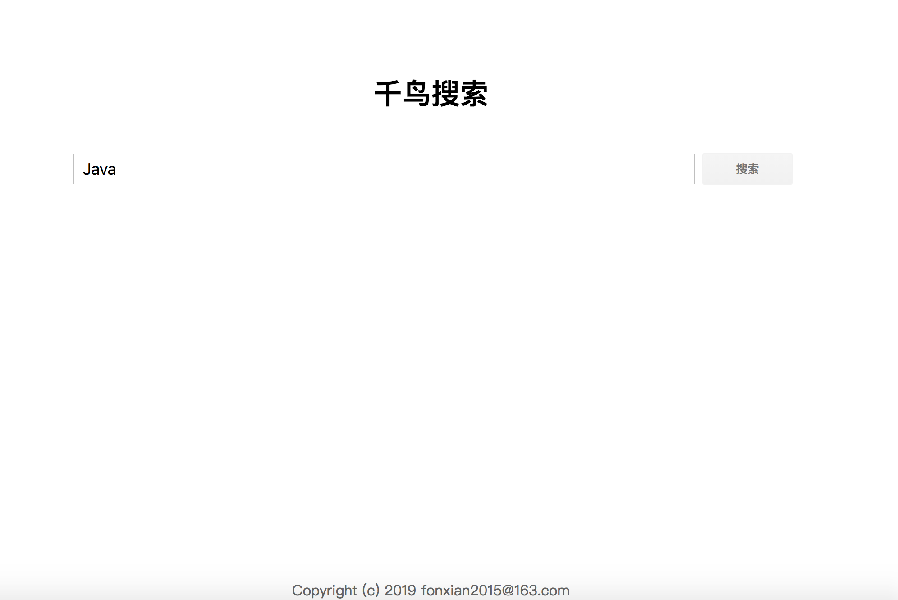

[Lucene学习笔记](https://github.com/fonxian/surfbird-search/wiki)


# 运行方法

1、启动Application

2、请求爬取数据、创建索引
```
curl http://127.0.0.1:8080/datas/index
```
3、访问首页
```
curl http://127.0.0.1:8080
```
# 功能
- WebMagic爬取博客园数据
- Lucene创建索引、搜索关键字
- 关键字高亮
- 同义词匹配（如企业=公司，泉城=济南）

# 页面效果

首页



搜索页


